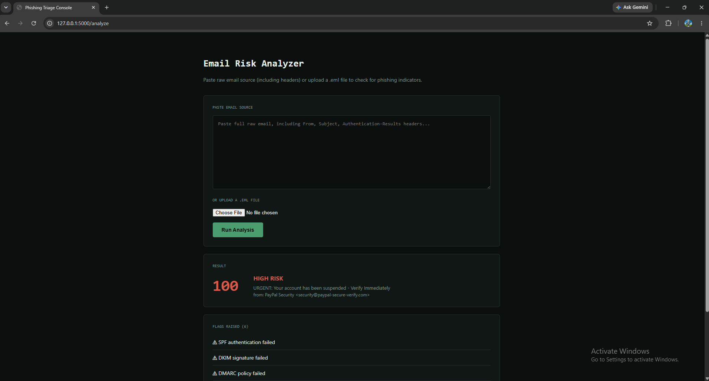
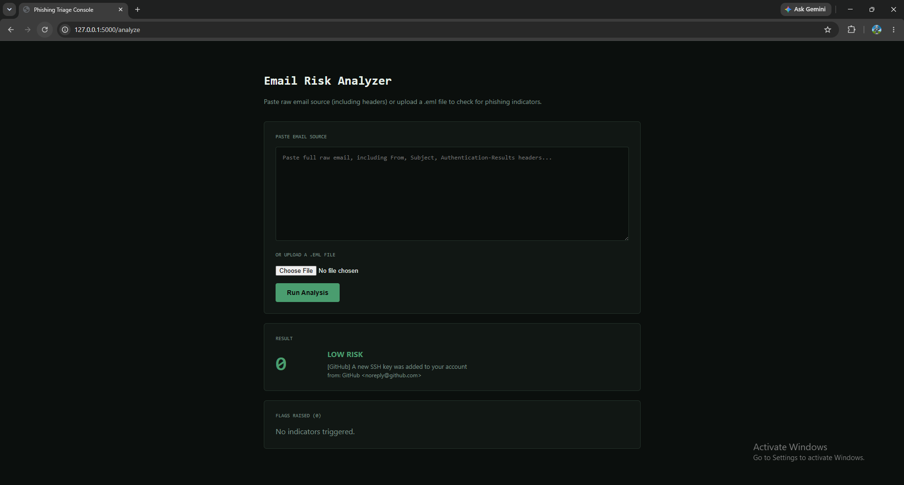

# Phishing Email Triage Console

A Flask-based tool that analyzes raw email content and produces a risk score by checking authentication results, sender/reply-to mismatches, suspicious URL patterns, and urgency language — automating the manual checklist a help desk or SOC Tier 1 analyst works through when a user reports a suspicious email.

## Why I built this

Phishing triage is one of the most common ticket types a help desk or SOC analyst handles day to day. Rather than just reading about phishing indicators, I built a tool that programmatically checks for them, to understand exactly what a mail server and a trained analyst are actually looking at under the hood — SPF/DKIM/DMARC authentication, domain spoofing, and credential-harvesting URL patterns.

## What it checks

**1. Email authentication (SPF / DKIM / DMARC)**

Parses the `Authentication-Results` header that receiving mail servers attach to every message, and checks whether the sending server passed or failed each of the three core anti-spoofing checks. A failure here means the email could not be verified as actually coming from the domain it claims to be from.

**2. Reply-To vs. From domain mismatch**

A classic phishing tactic: the visible `From` address looks legitimate, but the `Reply-To` header routes any reply to a completely different, attacker-controlled domain. Legitimate organizations don't do this.

**3. Suspicious URL patterns**

Scans all links in the email body for:
- Raw IP addresses used instead of a real domain name (e.g. `http://192.168.45.22/...`)
- Excessive subdomains designed to look legitimate at a glance (e.g. `login.secure.verify.paypal-account.com`)
- Credential-harvesting keywords embedded in the domain itself (`secure-`, `-verify`, `account-`, `login-`)

**4. Urgency language**

Flags subject lines using pressure tactics commonly used to short-circuit careful review — "verify immediately," "account suspended," "act now."

Each check contributes points toward a 0-100 risk score, bucketed into LOW (0-29) / MEDIUM (30-59) / HIGH (60-100).

## Tech stack

- **Python 3** — email parsing via the standard library `email` module, pattern matching via `re`
- **Flask** — web interface for pasting/uploading emails and viewing results

## Running it locally

Install Flask, then run the app:

    pip install flask
    python app.py

Visit `http://127.0.0.1:5000`. Paste raw email source (including headers) or upload a `.eml` file.

## How it was built

**1. Parsing email structure**

Built `analyzer.py` using Python's standard library `email` module to split a raw `.eml` file into headers and body — the foundation everything else reads from.

**2. Building the detection engine**

Wrote functions to check `Authentication-Results` for SPF/DKIM/DMARC pass/fail, compare `From` vs `Reply-To` domains, scan body URLs for raw IPs and suspicious subdomain patterns, and flag urgency language in the subject line. Each check adds points toward a 0-100 risk score.

**3. Testing the engine via command line**

Before building any UI, validated the scoring logic directly against both test `.eml` files from the terminal — confirming the phishing sample scored 100/HIGH with all 6 expected flags, and the legitimate sample scored 0/LOW with none.

**4. Building the web interface**

Wrapped the tested engine in a Flask app with a simple form for pasting raw email source or uploading a `.eml` file, and a results view showing the score, risk level, and the specific flags that were raised.

**5. End-to-end verification**

Ran both test cases through the live web interface to confirm the full pipeline — file/text input, parsing, scoring, and rendering — works correctly end to end (see screenshots below).

## Test cases

### Phishing example — scores 100/HIGH

Full raw email (`phishing_example.eml`):

    From: "PayPal Security" <security@paypal-secure-verify.com>
    Reply-To: support@account-recovery-team.net
    To: victim@example.com
    Subject: URGENT: Your account has been suspended - Verify Immediately
    Authentication-Results: mx.example.com; spf=fail smtp.mailfrom=paypal-secure-verify.com; dkim=fail header.d=paypal-secure-verify.com; dmarc=fail
    Date: Mon, 15 Jun 2026 09:14:22 -0500
    Content-Type: text/html; charset="UTF-8"

    <html>
    <body>
    
Dear Customer,

    
We have detected unusual activity on your account. Your account has been suspended.
    You must verify your identity immediately or it will be permanently closed.

    
<a href="http://192.168.45.22/login.secure.verify.paypal-account.com/index.php">Click here to verify your account</a>

    
Failure to act within 24 hours will result in permanent suspension.

    
PayPal Security Team

    </body>
    </html>

Flags raised:
- SPF authentication failed
- DKIM signature failed
- DMARC policy failed
- Reply-To domain (account-recovery-team.net) differs from From domain (paypal-secure-verify.com)
- Link uses raw IP address instead of domain: 192.168.45.22
- Subject contains urgency language: "urgent"

### Legitimate example — scores 0/LOW

Full raw email (`legitimate_example.eml`):

    From: "GitHub" <noreply@github.com>
    To: developer@example.com
    Subject: [GitHub] A new SSH key was added to your account
    Authentication-Results: mx.example.com; spf=pass smtp.mailfrom=github.com; dkim=pass header.d=github.com; dmarc=pass
    Date: Mon, 15 Jun 2026 14:02:10 -0500
    Content-Type: text/plain; charset="UTF-8"

    Hi there,

    A new SSH key was recently added to your account.

    Key name: work-laptop
    Added on: June 15, 2026

    If you did not add this key, please review your account security settings at https://github.com/settings/keys

    Thanks,
    The GitHub Team

No flags raised — all authentication checks passed, no domain mismatches, no suspicious URL patterns.

## Screenshots

**High-risk phishing email detected:**

**Legitimate email correctly scored as low risk:**

## Project structure

- `app.py` — Flask routes, handles file upload and pasted text input
- `analyzer.py` — core detection logic, header parsing, scoring engine
- `index.html` — web UI
- `phishing_example.eml` — test case: high-risk phishing email
- `legitimate_example.eml` — test case: legitimate email
- `screenshot_phishing_result.png` — tool output on the phishing sample
- `screenshot_legitimate_result.png` — tool output on the legitimate sample

## Key takeaway

Phishing triage is one of the highest-volume ticket types a help desk or SOC Tier 1 analyst handles. This project automates the same manual checklist an analyst works through by hand — authentication verification, domain comparison, and link inspection — and pairs with the [osTicket help desk lab](https://github.com/Ghummun/osticket-help-desk-lab) and [Active Directory home lab](https://github.com/Ghummun/active-directory-home-lab) to cover detection, ticketing, and identity management across the help desk workflow.

## What I'd add next

- VirusTotal API integration for live URL reputation checks against known-malicious domains
- Attachment hash scanning against known-malware hash databases
- Bulk `.eml` upload for batch triage of multiple reported emails at once
- Export findings as a ticket-ready summary formatted for ServiceNow or osTicket
